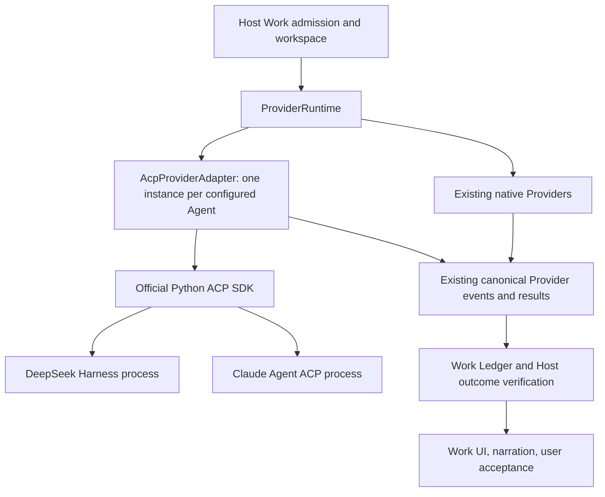

# ACP Work Providers — experimental

Status: experimental, opt-in ACP v1 integration for 0.15 Alpha. It has not been
integrated into real production use. Codex remains the existing default coding Provider.

Claude and DeepSeek Harness (dsh) below are historical local integration examples,
not production-qualified Providers. Native probes and deterministic protocol tests
establish bounded behavior; they do not establish daily-use reliability or a complete
Amadeus-to-agent production workflow.

Amadeus reuses `agent-client-protocol==0.12.1` for stdio framing, typed
messages, notification draining, and subprocess lifetime. `AcpProviderAdapter`
translates that protocol into the existing Provider request/event/result
contract. DeepSeek Harness and Claude run externally and own their agent loops,
tools, native sessions, and native execution policies.



## Setup

Install the optional Host dependency in the Python environment that runs Amadeus:

```powershell
python -m pip install -e ".[acp]"
```

The dev extra/CI lock includes it so deterministic ACP tests run in CI. The
default CPU runtime does not require the SDK or any external agent installation.

Install an Agent separately, following its upstream instructions. The initial
native probes on 2026-09-13 used these npm packages in an isolated directory.
These are the historical example versions, not a claim about current releases:

- `@deepseek-ai/dsh@0.1.5-rc.1`
- `@agentclientprotocol/claude-agent-acp@0.76.0`

Settings → Providers → ACP agents offers DeepSeek, Claude, and custom entries.
Choose a unique id, an executable, and separate arguments; enable the entry,
save, and restart the backend. An Agent is registered only when its local
executable, SDK and required environment references are available. Registration
does not certify authentication or protocol capabilities: those are checked
when the Agent connects. Existing Agents and the model-less Host still start
when an ACP entry is unavailable.

On Windows use `node.exe` with the installed JavaScript entry point. The Host
does not invoke `.cmd`/`.bat`/PowerShell launchers through a shell or automatically
install packages. Example argument lists:

```text
DeepSeek:
C:/agents/node_modules/@deepseek-ai/dsh/lib/bin.js
--profile
acp

Claude:
C:/agents/node_modules/@agentclientprotocol/claude-agent-acp/dist/index.js
```

For headless startup, the same configuration is supplied in
`AMADEUS_ACP_PROVIDERS` (JSON array). This is the one registry for both entry
points; it is not discovered from the delegated workspace:

```json
[
  {
    "id": "deepseek",
    "name": "DeepSeek Harness",
    "command": "node",
    "args": ["C:/agents/node_modules/@deepseek-ai/dsh/lib/bin.js", "--profile", "acp"],
    "enabled": true,
    "resume": true,
    "environment": {"DEEPSEEK_API_KEY": "DEEPSEEK_API_KEY"},
    "config_options": {}
  },
  {
    "id": "claude",
    "name": "Claude",
    "command": "node",
    "args": ["C:/agents/node_modules/@agentclientprotocol/claude-agent-acp/dist/index.js"],
    "enabled": false,
    "resume": true,
    "environment": {},
    "config_options": {}
  }
]
```

`environment` maps the child environment variable to the **name** of a Host
environment variable. Its values are never credentials. Secrets can be stored
using the existing encrypted Desktop settings (DeepSeek/Anthropic keys), supplied
in the backend environment, or obtained through the Agent's existing login.
Omit an API-key reference when using an existing native login. The SDK inherits
only its standard OS environment allowlist; other Host credentials and MCP
bindings are not copied into the Agent process.

Use an explicit `DSH_HOME` reference if you want a dedicated DeepSeek profile.
This is an Agent-owned configuration location, not a second Amadeus Project.

## Models and capabilities

The first native session returns its `configOptions`. Settings can refresh and
display these choices after that connection. Saved selections apply when a
subsequent run opens its session, after the backend restart. Explicit overrides
also accept `option-id=value` entries; unsupported ids/values fail before prompt
submission. Changing model-dependent options uses each complete updated native
configuration response. No model catalog is fabricated from vendor names.

An enabled persistent-session setting requires `session/resume` or
`loadSession` in the native handshake. An unsupported or stale attachment fails;
it never creates a fresh session or silently resubmits an old prompt. ACP v1's
advertised optional resume/close methods are used through the official SDK.
The first version does not advertise active append-input, immediate steering,
submission reconciliation, or Host Skill projection. Native Agent skills and
configuration remain Agent-owned. No ACP v2 or Agent-specific extension is implied.

The existing MCP settings can bind connections to the individual ACP Provider
ids. Only enabled bindings for that Provider are projected. HTTP support is
checked at initialization. ACP v1 has no per-server cwd field, so a different
configured stdio MCP cwd is rejected before starting the prompt rather than
discarded. Host MCP tools remain inaccessible to Main Chat.

## Lifecycle and authority

- Each run uses one SDK-managed process. There is no second scheduler or daemon.
  A completed session may be persisted by the native Agent and explicitly
  attached by the Host on a later run; the process is not kept alive for idle UI.
- The Host chooses cwd and owns Project, WorkItem, Attempt and run ids. The
  typed Provider session is checkpointed before submitting the user's prompt.
- Tools execute inside the external Agent under its configured native policy.
  ACP is not an OS sandbox and does not standardize a cross-Agent read-only
  sandbox. An Agent installation must be trusted for its configured execution
  scope; this adapter does not claim Codex sandbox parity.
- Native tool requests enter the existing Host permission service. An allow-once
  decision selects only an ACP `allow_once` option, never `allow_always`.
  Replies must bind the current run and pending request. Timeout, cancellation,
  and shutdown expire pending requests. Agent modes cannot grant Host product
  permissions such as export or AUIP launch.
- A cancellation write or process exit cannot prove cancellation. Only a native
  terminal acknowledgement (or cancellation before submission) confirms it.
- EOF, a missing terminal acknowledgement, malformed/lost event projection, or
  unconfirmed timeout after submission yields an orphaned unknown outcome. It
  cannot authorize automatic retry/resume. ACP `auth_required` is an explicit
  admission rejection and yields an actionable failure instead.
- Native text/tool activity is evidence. Host result verification, artifact
  provenance, Work completion and user acceptance retain their existing owners.

## Verification

`tests/test_acp_provider.py` uses actual SDK connections and separate test Agent
processes, without a model. It covers input/terminal ordering, configured models,
credential isolation, distinct Provider identity, native attachment, approvals,
cancellation, EOF, malformed notifications, slow Host projection, timeout and
shutdown. A real Runtime/Store/Coordinator case verifies durable Work identity
and that Agent prose cannot create artifacts or user acceptance.

`electron/tests/acpSettings.test.mjs` verifies persistence, encrypted credential
separation, environment precedence, validation and MCP bindings for configured ids.

An explicit native probe is available:

```powershell
python tools/probes/probe_acp_provider.py --config C:/agents/amadeus-acp.json --provider deepseek --workspace C:/agents/test-workspace
```

By default it only initializes the Agent. Add `--task "Reply briefly without
tools"` to exercise the adapter with a real model; this mode rejects native
permission requests and does not create or complete a Host WorkItem.

### Historical local examples (2026-09-13, Windows)

| Agent | Example setup | Bounded observation |
| --- | --- | --- |
| DeepSeek Harness (dsh), `@deepseek-ai/dsh@0.1.5-rc.1` | `node` with `lib/bin.js --profile acp`; Host environment references supply the Agent's credentials | Negotiated ACP v1, completed a real model reply and returned a native session. |
| Claude, `@agentclientprotocol/claude-agent-acp@0.76.0` | `node` with `dist/index.js`; existing official Claude Code CLI login, without an API-key override | First returned authentication-required; after login, negotiated ACP v1 and completed a real model reply through the ACP/Agent SDK path. |

These were disposable local integration probes. Neither example has been integrated
into real production use, and neither is a complete release or human UI acceptance.

Both Agents also passed a two-process continuity probe (the resumed session
recalled a marker from the preceding process), application of an advertised
model selection, and a real native file-read task whose output matched the
disposable input file. Canonical `tool.call`/`tool.result` and progress events
were observed for both. The settings form was rendered and its edit/save/model
selector behavior checked in a browser with mocked Desktop IPC; this does not
claim a full running-Electron end-to-end journey.

## Upstream references

- [Official Python SDK and lifecycle examples](https://github.com/agentclientprotocol/python-sdk)
- [DeepSeek's automation ACP contract](https://github.com/deepseek-ai/deepseek-harness/blob/master/packages/acp/acp/README.md)
- [Claude Agent ACP bridge](https://github.com/agentclientprotocol/claude-agent-acp)
- [ACP v1 configuration](https://agentclientprotocol.com/protocol/v1/session-config-options)
- [ACP v2 migration and draft boundary](https://agentclientprotocol.com/protocol/v2/migration)

Reuse focuses on the SDK's connection and cleanup owners and the Agents'
capability-driven session/configuration behavior. No upstream implementation
is copied into the Host, and v2 changes remain a future adapter concern.
